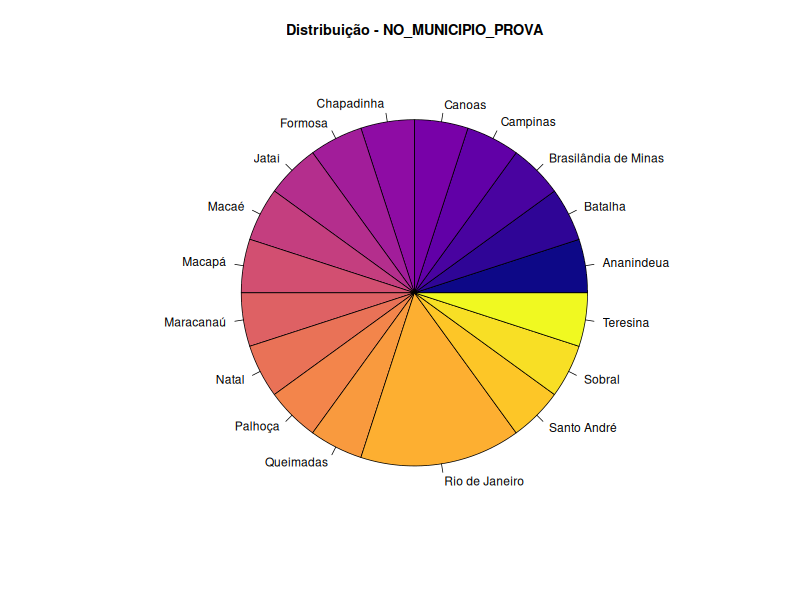

## Análise Exploratória de Dados do ENEM 2023

## Visão Geral do Projeto
Este projeto consiste em uma análise exploratória dos microdados de uma amostra do ENEM 2023. O objetivo é extrair informações descritivas de variáveis qualitativas e quantitativas por meio de estatísticas sumarizadas e visualizações. A análise, desenvolvida em **R** e documentada em **R Markdown**, visa identificar padrões, tendências de desempenho e características da amostra de participantes.

---

## Metodologia
A análise seguiu um processo estruturado, utilizando técnicas de estatística descritiva:
- **Variáveis Qualitativas:** Foram exploradas por meio de **tabelas de frequência**, **gráficos de barras** e **gráficos de pizza**, que ajudam a entender a distribuição de categorias.
- **Variáveis Quantitativas:** A distribuição e a dispersão foram analisadas com **estatísticas sumarizadas** (média, mediana, desvio padrão, etc.), **histogramas** e **boxplots**.

Para cada variável, os resultados estatísticos e visuais foram acompanhados de uma interpretação para contextualizar os dados e extrair *insights*.

---

## Estrutura do Repositório
A organização do projeto foi pensada para garantir reprodutibilidade e facilitar a navegação.

```
Projeto_Analise_Descritiva_ENEM/
├── data/                      # Armazena o conjunto de dados brutos.
├── outputs/                   # Contém os resultados e gráficos gerados.
│   ├── graficos/              # Armazena todas as visualizações.
│   │   ├── qualitativas/      # Gráficos de barras e pizza.
│   │   └── quantitativas/     # Histogramas e boxplots.
├── scripts/                   # Scripts auxiliares, se houver.
├── analise_enem.Rmd           # O script principal em RMarkdown.
├── Projeto_Analise_Descritiva_ENEM.Rproj # Arquivo de projeto do RStudio
└── README.md                  # Este arquivo.
```

---

## Como Reproduzir a Análise
Para replicar a análise e gerar o relatório em HTML, siga os passos abaixo no RStudio:

1. Abra o arquivo `analise_enem.Rmd` diretamente no RStudio.
2. Instale os pacotes necessários executando o seguinte comando no console do R:
   
    ```r
    install.packages(c("tidyverse", "summarytools", "knitr", "kableExtra"))
    ```

3. Com os pacotes instalados, clique em **"Knit"** no RStudio para renderizar o relatório e gerar o arquivo `analise_enem.html` na pasta principal do projeto, junto com os gráficos e tabelas na pasta `outputs`.

---

## Resultados da Análise Descritiva

Este documento apresenta as principais descobertas sobre as variáveis quantitativas e qualitativas da amostra do ENEM 2023.

### Variáveis Quantitativas
As notas das cinco provas e a média geral foram analisadas.

| Variável                 | Média | Mediana | Desvio Padrão | IQR   | Mín. | Máx. |
| :----------------------- | :---- | :------ | :------------ | :---- | :--- | :--- |
| **Ciências da Natureza** | 492.7 | 471.7   | 91.7          | 127.8 | 363.3 | 696.3 |
| **Ciências Humanas** | 510.3 | 511.1   | 89.7          | 98.5  | 307.4 | 650.4 |
| **Linguagens e Códigos** | 542.6 | 555.9   | 59.6          | 47.7  | 359.5 | 621.2 |
| **Matemática** | 538.1 | 509.2   | 123.6         | 202.0 | 392.5 | 794.6 |
| **Redação** | 669.0 | 670.0   | 180.1         | 250.0 | 280.0 | 920.0 |
| **Média das 5 Notas** | 550.5 | 538.2   | 87.7          | 109.0 | 399.9 | 726.1 |

**Principais *Insights***:
- **Assimetria nas notas:** A nota de **Matemática** apresenta a maior diferença entre média e mediana (538.1 vs. 509.2), seguida por **Linguagens e Códigos** e **Ciências da Natureza**. Isso sugere uma distribuição assimétrica, provavelmente influenciada por um pequeno número de notas muito altas, que puxam a média para cima.
- **Maior dispersão:** A **Nota de Redação** e a **Nota de Matemática** demonstram a maior variabilidade (desvio padrão de 180.1 e 123.6, respectivamente), indicando que o desempenho dos participantes nessas áreas foi menos homogêneo.
- **Dispersão da Média Geral:** A média geral das 5 notas tem um desvio padrão de 87.7, refletindo uma dispersão moderada entre o desempenho global dos participantes.

---

### Variáveis Qualitativas
A distribuição dos participantes por categorias geográficas e de língua estrangeira foi analisada.

| Variável                 | Categoria Mais Frequente     | Frequência | Categoria Menos Frequente    | Frequência |
| :----------------------- | :--------------------------- | :--------- | :--------------------------- | :--------- |
| **Região** | Nordeste e Sudeste           | 7 (35%)    | Centro-Oeste, Norte e Sul    | 2 (10%)    |
| **UF** | Rio de Janeiro (RJ)          | 4 (20%)    | Várias UFs                   | 1 (5%)     |
| **Município** | Rio de Janeiro               | 3 (15%)    | Vários Municípios            | 1 (5%)     |
| **Capital da UF?** | Não                          | 14 (70%)   | Sim                          | 6 (30%)    |
| **Língua Estrangeira** | Espanhol                     | 11 (55%)   | Inglês                       | 9 (45%)    |

**Principais *Insights***:
- **Concentração Geográfica:** A amostra é predominantemente das regiões **Sudeste e Nordeste** (70% dos participantes), com uma sub-representação das demais regiões.
- **Desempenho por Localidade:** O número de participantes que realizaram a prova em cidades que **não são capitais** é mais que o dobro (14 vs. 6) daqueles que a fizeram em capitais.
- **Preferência de Língua:** Há uma ligeira preferência pelo **Espanhol** sobre o **Inglês** como língua estrangeira na amostra, embora a diferença seja pequena.

---

## Gráficos e Visualizações
A seguir, apresentamos uma galeria de gráficos que visualizam a distribuição das variáveis, suportando as estatísticas apresentadas. Cada visualização inclui uma breve análise dos padrões observados.

### Análise das Notas Quantitativas

##### Nota de Ciências da Natureza


O histograma mostra uma distribuição dispersa, com a maior concentração de notas entre 400 e 500. A média (linha vermelha) está ligeiramente à direita da mediana (linha verde), indicando uma assimetria positiva, com notas mais altas puxando a média.


O boxplot reforça a dispersão, com o Intervalo Interquartil (IQR) abrangendo uma faixa ampla. A mediana em torno de 470 está próxima da base da caixa, o que, junto à média mais alta, confirma a assimetria positiva.

##### Nota de Ciências Humanas


A distribuição das notas de Ciências Humanas é mais simétrica, com a maioria dos participantes concentrada na faixa de 500 a 600. A média e a mediana estão bem próximas, como as estatísticas de resumo já indicavam.


A caixa do boxplot é mais estreita do que a de Ciências da Natureza, indicando menor dispersão. A mediana está centralizada, e há alguns *outliers* na parte inferior da distribuição, representando notas muito baixas.

##### Nota de Linguagens e Códigos


As notas de Linguagens e Códigos mostram uma concentração clara em valores mais altos, entre 550 e 600, com um pico de frequência. A média é ligeiramente inferior à mediana, indicando uma assimetria negativa.


O boxplot destaca a concentração na faixa de 520 a 570. A mediana está na parte superior da caixa, e um *outlier* em 350 confirma a assimetria negativa.

##### Nota de Matemática


O histograma de Matemática é o que apresenta a maior assimetria. As notas estão concentradas em torno de 500, mas uma cauda longa de notas altas puxa a média para bem acima da mediana, um padrão comum em provas de Matemática do ENEM.


O boxplot ilustra essa assimetria de forma nítida. A mediana está na parte inferior da caixa, e a haste superior é consideravelmente mais longa que a inferior, refletindo a ampla dispersão e as notas altas.

##### Nota de Redação


A distribuição da nota de Redação é a mais dispersa, com picos em notas arredondadas (560, 680, 800 e 860), o que é esperado devido ao sistema de pontuação em intervalos de 20 pontos. A média e a mediana são muito próximas, indicando uma distribuição simétrica.


O boxplot confirma a simetria, com a mediana centralizada na caixa. A ausência de *outliers* notáveis e as hastes longas mostram uma dispersão uniforme de notas.

##### Média das 5 Notas


A distribuição da média das notas apresenta múltiplos picos, refletindo a variabilidade do desempenho geral. A média está um pouco acima da mediana, indicando uma leve assimetria positiva.


O boxplot da média geral mostra que a maioria dos participantes tem um desempenho entre 490 e 600. A mediana em 530 está na metade inferior da caixa, e a haste superior é mais longa, confirmando que notas médias mais altas são responsáveis pela assimetria.

---

### Análise das Variáveis Qualitativas

#### Município/Capital UF Prova


Os gráficos mostram que a maioria dos participantes da amostra realizou a prova em municípios que não são capitais (70%), evidenciando a diversidade geográfica.

#### Município de Prova



A distribuição por município é bastante dispersa, com a maior concentração de participantes no Rio de Janeiro (15% da amostra), seguido por outros municípios com frequência menor.

#### UF de Prova


Os gráficos de UF refletem a concentração observada nos municípios, com o Rio de Janeiro (RJ) liderando com 20% da amostra.

#### Região de Prova


A análise por região demonstra a forte representação do Sudeste e do Nordeste (35% cada), enquanto as demais regiões (Sul, Norte e Centro-Oeste) têm uma representação menor na amostra.

#### Língua Estrangeira


A preferência pela língua estrangeira é ligeiramente inclinada para o Espanhol (55%), mas a divisão é bastante equilibrada em comparação com o Inglês (45%).

---
## Conclusão

A análise exploratória dos microdados do ENEM 2023 revelou padrões importantes na amostra estudada. A maior parte das notas quantitativas apresentou distribuições assimétricas, especialmente em Matemática, o que indica uma grande variação de desempenho entre os participantes.

Além disso, a análise qualitativa mostrou uma concentração de participantes nas regiões Sudeste e Nordeste, e uma leve preferência pela prova de Língua Estrangeira Espanhol. Essas descobertas fornecem uma visão inicial do comportamento e das características dos participantes, servindo como base para análises mais aprofundadas, como estudos de correlação e modelagem preditiva.

O trabalho destaca a importância da estatística descritiva e da visualização de dados como etapas cruciais para a compreensão de grandes conjuntos de dados.
