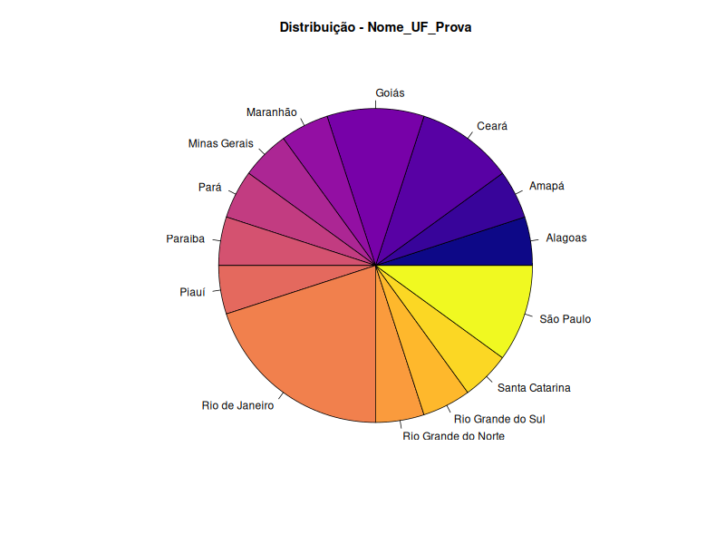
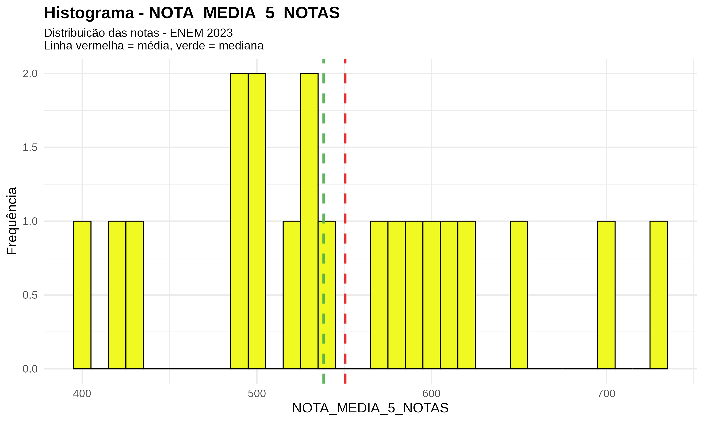

# Projeto: Análise Descritiva dos Dados do ENEM

## Disciplina
Este projeto foi desenvolvido para a disciplina **Estatística**, ministrada pela professora **Simone de Araújo Góes Assis**, do curso de **Ciência de Dados e IA** do **IESB**.

---

## Descrição
Este projeto tem como objetivo realizar a **análise descritiva das variáveis do ENEM**, resolvendo o seguinte problema:

> Na base de dados destinada a cada aluno, fazer a análise descritiva das variáveis do ENEM.  
> Nas variáveis qualitativas, gerar **tabelas de frequência** e gráficos de **barras ou pizza**.  
> Nas variáveis quantitativas, extrair **estatísticas descritivas** e gerar **histogramas e boxplots**.  
> Por fim, produzir uma **análise descritiva escrita** em um parágrafo para cada variável.  
> Utilizar **Python e/ou R e/ou SAS**.

O relatório foi desenvolvido em **R**, usando **RMarkdown** para gerar os gráficos e as análises automáticas.  

---

## Estrutura de Pastas

Projeto_Analise_Descritiva_ENEM/
│
├── data/ 

├── outputs/ 

│ ├── graficos/

│ ├── qualitativas/

│ └── quantitativas/

├── scripts/ 

├── analise_enem.Rmd 

├── Projeto_Analise_Descritiva_ENEM.Rproj

└── README.md 


---

## Como Rodar

1. Abra o projeto no **RStudio**:  
   Clique em `Projeto_Analise_Descritiva_ENEM.Rproj`.

2. Instale os pacotes necessários (caso não estejam instalados):


```r
install.packages(c("tidyverse", "summarytools", "plotrix", "knitr", "kableExtra", "readxl"))

### TP_LINGUA


```

## Variáveis Qualitativas

### Municipio/Capital UF Prova
  
  

### NO_MUNICIPIO_PROVA
  
  

### Nome_UF_Prova
  
  

### Regiao_Nome_Prova
  
  

### SG_UF_PROVA
  
  

### TP_LINGUA
  
  

---

## Variáveis Quantitativas

### NOTA_CH_CIENCIAS_HUMANAS
  
  

### NOTA_CN_CIENCIAS_DA_NATUREZA
  
  

### NOTA_LC_LINGUAGENS_E_CODIGOS
  
  

### NOTA_MT_MATEMATICA
  
  

### NOTA_REDACAO
  
  

### NOTA_MEDIA_5_NOTAS
  
  
