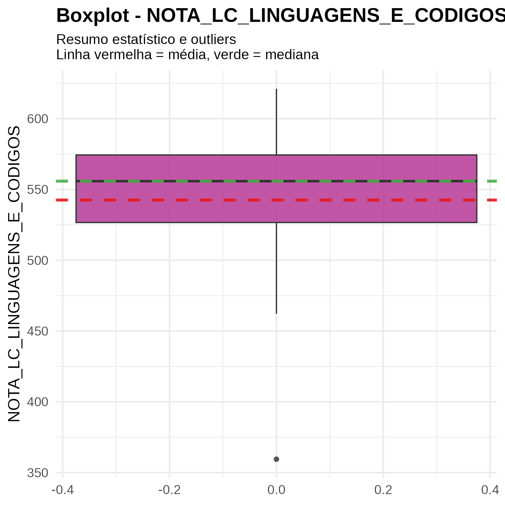
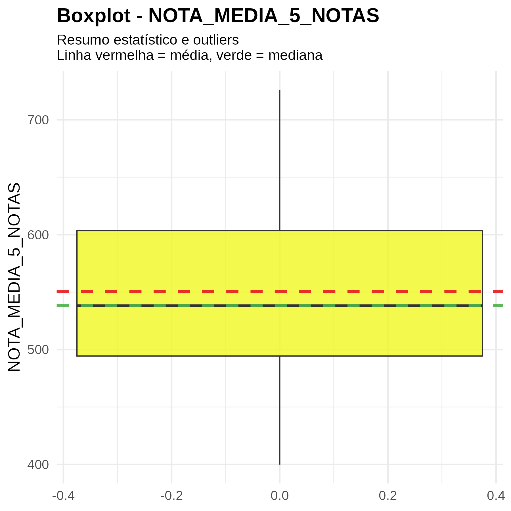

# Análise Descritiva dos Dados do ENEM

## Visão Geral do Projeto
Este projeto foi desenvolvido para a disciplina de **Estatística** no curso de **Ciência de Dados e IA** no IESB. O objetivo principal é realizar uma **análise descritiva** de um conjunto de dados do **ENEM**. O projeto aborda a análise de variáveis qualitativas e quantitativas, gerando tabelas, estatísticas e visualizações para cada uma delas. Todo o trabalho foi realizado em **R**, utilizando **RMarkdown** para automatizar a geração de relatórios e gráficos.

---

## Metodologia

O projeto seguiu a seguinte metodologia para a análise de cada variável:

* **Variáveis Qualitativas**: foram geradas tabelas de frequência e visualizações como gráficos de barras e de pizza.
* **Variáveis Quantitativas**: foram extraídas estatísticas descritivas (média, mediana, desvio padrão, etc.) e criados histogramas e boxplots.
* **Análise Escrita**: para cada variável, foi elaborada uma análise descritiva em um parágrafo.

---

## Estrutura do Repositório
A organização das pastas e arquivos facilita a navegação e a execução do projeto.

Projeto_Analise_Descritiva_ENEM/
├── data/                      # Armazena o conjunto de dados brutos.

├── outputs/                   # Contém os resultados e gráficos gerados.

│   ├── graficos/              # Armazena todas as visualizações.

│   │   ├── qualitativas/      # Gráficos de barras e pizza.

│   │   └── quantitativas/     # Histogramas e boxplots.

├── scripts/                   # Scripts auxiliares, se houver.

├── analise_enem.Rmd           # O script principal em RMarkdown.

├── Projeto_Analise_Descritiva_ENEM.Rproj # Arquivo de projeto do RStudio

└── README.md                  # Este arquivo.

---

## Como Rodar o Projeto
Para replicar a análise, siga os passos abaixo:

1.  Abra o arquivo `Projeto_Analise_Descritiva_ENEM.Rproj` no **RStudio** para carregar o projeto corretamente.
2.  Instale os pacotes necessários rodando o seguinte comando no console do R:

    ```r
    install.packages(c("tidyverse", "summarytools", "plotrix", "knitr", "kableExtra", "readxl"))
    ```

3.  Abra o arquivo `analise_enem.Rmd` e clique em **"Knit"** para gerar o relatório final em HTML, que incluirá todas as análises e gráficos.

---

## Análise das Variáveis
A seguir, estão os gráficos e visualizações gerados para cada variável analisada, divididos por tipo.

### Variáveis Qualitativas

* **Município/Capital UF Prova**
    
    


A análise do gráfico de barras fornecida revela a concentração de participantes do ENEM 2023 em relação à realização da prova em uma capital de unidade federativa (UF).

O gráfico mostra duas categorias:

Sim: 6

Não: 14

Essa representação indica que, na amostra analisada, a maioria dos participantes (14) realizou a prova do ENEM em municípios que não são capitais de suas respectivas UFs. Em contraste, um número menor de participantes (6) fez a prova em uma capital.

* **NO\_MUNICIPIO\_PROVA**
    
    

* **Nome\_UF\_Prova**
    
    

* **Regiao\_Nome\_Prova**
    
    

* **SG\_UF\_PROVA**
    
    

* **TP\_LINGUA**
    
    

---

### Variáveis Quantitativas

* **NOTA\_CH\_CIENCIAS\_HUMANAS**
    
    

* **NOTA\_CN\_CIENCIAS\_DA\_NATUREZA**
    
    

* **NOTA\_LC\_LINGUAGENS\_E\_CODIGOS**
    
    

* **NOTA\_MT\_MATEMATICA**
    
    

* **NOTA\_REDACAO**
    
    

* **NOTA\_MEDIA\_5\_NOTAS**
    
    
