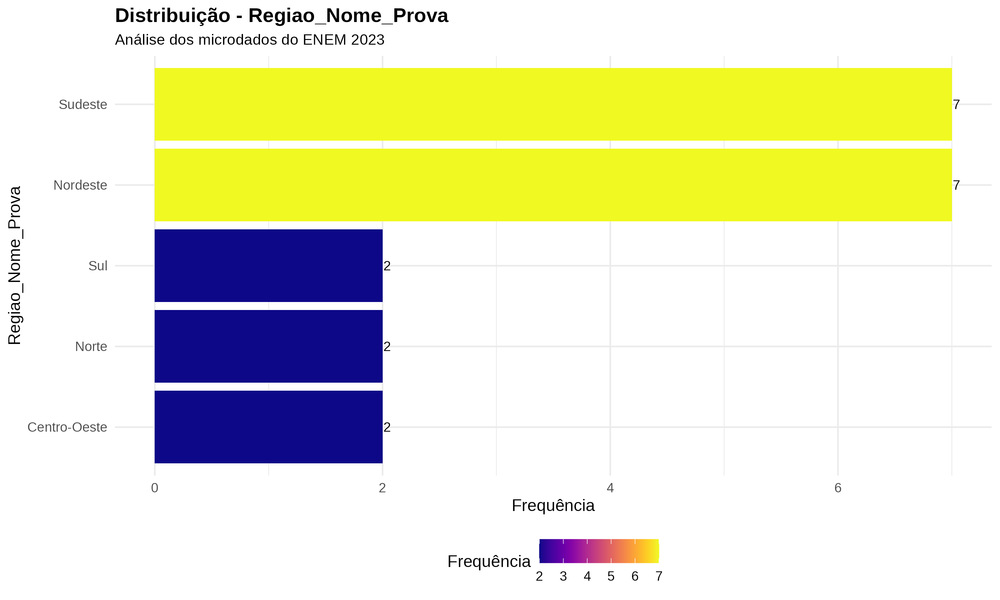
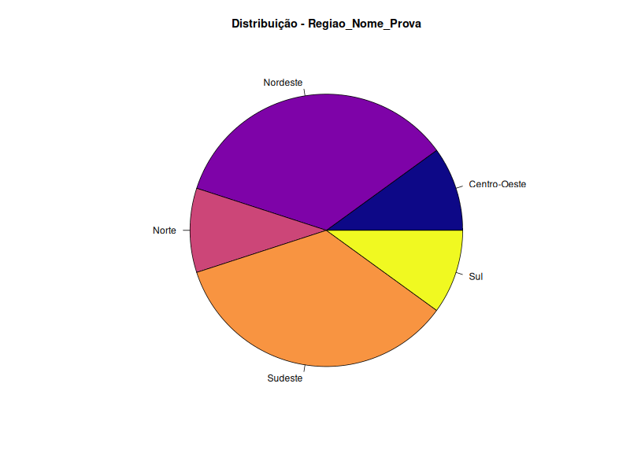
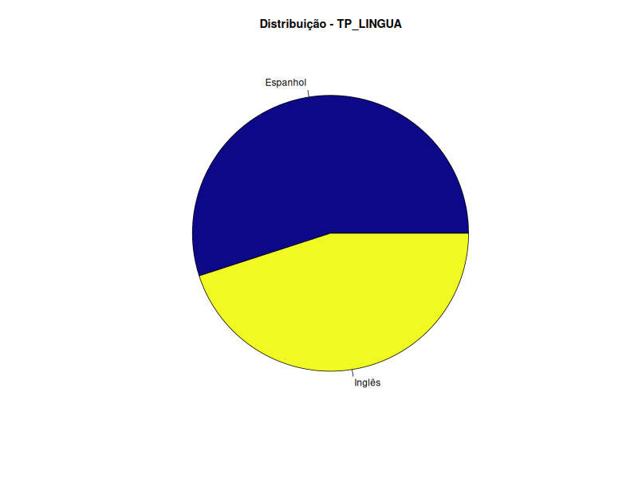
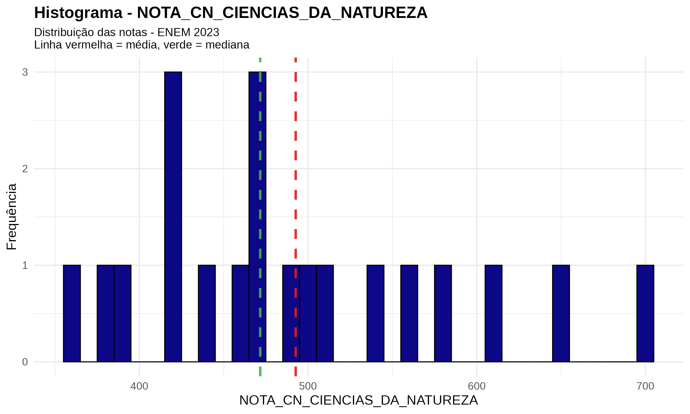

# Análise Descritiva dos Dados do ENEM

## Visão Geral do Projeto
Este projeto foi desenvolvido para a disciplina de **Estatística** no curso de **Ciência de Dados e IA** no IESB. O objetivo principal é realizar uma **análise descritiva** de um conjunto de dados do **ENEM**. O projeto aborda a análise de variáveis qualitativas e quantitativas, gerando tabelas, estatísticas e visualizações para cada uma delas. Todo o trabalho foi realizado em **R**, utilizando **RMarkdown** para automatizar a geração de relatórios e gráficos.

---

## Metodologia

O projeto seguiu a seguinte metodologia para a análise de cada variável:

* **Variáveis Qualitativas**: foram geradas tabelas de frequência e visualizações como gráficos de barras e de pizza.
* **Variáveis Quantitativas**: foram extraídas estatísticas descritivas (média, mediana, desvio padrão, etc.) e criados histogramas e boxplots.
* **Análise Escrita**: para cada variável, foi elaborada uma análise descritiva em um parágrafo.

---

## Estrutura do Repositório
A organização das pastas e arquivos facilita a navegação e a execução do projeto.

Projeto_Analise_Descritiva_ENEM/
├── data/                      # Armazena o conjunto de dados brutos.

├── outputs/                   # Contém os resultados e gráficos gerados.

│   ├── graficos/              # Armazena todas as visualizações.

│   │   ├── qualitativas/      # Gráficos de barras e pizza.

│   │   └── quantitativas/     # Histogramas e boxplots.

├── scripts/                   # Scripts auxiliares, se houver.

├── analise_enem.Rmd           # O script principal em RMarkdown.

├── Projeto_Analise_Descritiva_ENEM.Rproj # Arquivo de projeto do RStudio

└── README.md                  # Este arquivo.

---

## Como Rodar o Projeto
Para replicar a análise, siga os passos abaixo:

1.  Abra o arquivo `Projeto_Analise_Descritiva_ENEM.Rproj` no **RStudio** para carregar o projeto corretamente.
2.  Instale os pacotes necessários rodando o seguinte comando no console do R:

    ```r
    install.packages(c("tidyverse", "summarytools", "plotrix", "knitr", "kableExtra", "readxl"))
    ```

3.  Abra o arquivo `analise_enem.Rmd` e clique em **"Knit"** para gerar o relatório final em HTML, que incluirá todas as análises e gráficos.

---

## Análise das Variáveis
A seguir, estão os gráficos e visualizações gerados para cada variável analisada, divididos por tipo.

### Variáveis Qualitativas

* **Município/Capital UF Prova**
    

A análise do gráfico de barras fornecida revela a concentração de participantes do ENEM 2023 em relação à realização da prova em uma capital de unidade federativa (UF).

O gráfico mostra duas categorias:

- **Sim:** 6  
- **Não:** 14  

Essa representação indica que, na amostra analisada, a maioria dos participantes (**14**) realizou a prova do ENEM em municípios que não são capitais de suas respectivas UFs. Em contraste, um número menor de participantes (**6**) fez a prova em uma capital.

    


O gráfico de pizza representa a mesma informação do gráfico de barras anterior, mas de uma maneira diferente.

Aqui, a distribuição dos participantes do ENEM 2023 é visualizada por meio de proporções. As duas categorias são:

- **Não (cor azul escura):** Este setor, o maior do gráfico, representa a maioria dos participantes que fizeram a prova em municípios que não são capitais.
- **Sim (cor amarela):** Este setor, menor que o anterior, representa a proporção de participantes que realizaram a prova em uma capital de unidade federativa (UF).

O gráfico de pizza é ideal para visualizar a representatividade proporcional de cada grupo em relação ao todo. O tamanho de cada fatia corresponde diretamente à quantidade de participantes em cada categoria, deixando claro que a maioria dos participantes da amostra realizou a prova fora de uma capital.


* **NO\_MUNICIPIO\_PROVA**
    

O gráfico de barras detalha a frequência de participantes do ENEM 2023 por município, em uma amostra específica.

A visualização mostra a distribuição dos participantes entre diversos municípios, com destaque para a frequência de cada um. A análise revela:

- **Rio de Janeiro:** 3 participantes na amostra (maior frequência).
- **Ananindeua, Batalha, Brasilândia de Minas, Campinas, Canoas, Chapadinha, Formosa, Jataí, Macaé, Macapá, Maracanaú, Natal, Palhoça, Queimadas, Santo André, Sobral e Teresina:** 1 participante cada.

Isso sugere uma alta concentração de participantes no **Rio de Janeiro**, enquanto os demais municípios da amostra apresentam uma distribuição mais dispersa e com menor número de participantes, refletindo a distribuição populacional e de locais de prova.


O gráfico de pizza apresenta a mesma distribuição de frequência por município, mas de uma forma proporcional.

A visualização confirma a análise do gráfico de barras anterior, mostrando que a fatia correspondente ao **Rio de Janeiro** é a maior e mais destacada, indicando que esse município concentra a maior proporção de participantes na amostra.

As demais fatias, representando os outros municípios, são de tamanho similar e significativamente menores que a do Rio de Janeiro. Isso demonstra que a maioria dos municípios listados na amostra tem uma proporção de participantes muito pequena e similar entre si, enquanto o Rio de Janeiro é um polo de prova mais expressivo para este conjunto de dados.


* **Nome\_UF\_Prova**
    

O gráfico de barras ilustra a frequência de participantes do ENEM 2023 por estado (Unidade da Federação - UF) em uma amostra de dados.

A análise do gráfico revela o seguinte padrão de distribuição:

- **Rio de Janeiro:** 4 participantes (maior frequência na amostra).  
- **São Paulo, Goiás e Ceará:** 2 participantes cada.  
- **Santa Catarina, Rio Grande do Sul, Rio Grande do Norte, Piauí, Paraíba, Pará, Minas Gerais, Maranhão, Amapá e Alagoas:** 1 participante cada.

Essa distribuição mostra que, enquanto alguns estados concentram um número maior de participantes, a maioria das UFs na amostra tem uma representação menor e mais uniforme.


O gráfico de pizza mostra a distribuição proporcional dos participantes do ENEM 2023 por Unidade da Federação (UF) em uma amostra.

A visualização em pizza confirma os dados do gráfico de barras anterior, mas de uma forma que enfatiza as proporções. A análise revela o seguinte:

- A fatia correspondente ao **Rio de Janeiro** é a maior de todas, refletindo sua maior frequência de participantes na amostra.  
- As fatias de **São Paulo, Goiás e Ceará** são as próximas em tamanho, confirmando que esses estados têm uma proporção de participantes maior do que os demais.  
- As fatias menores e de tamanhos semelhantes representam o restante das UFs, que registraram apenas um participante cada.

O gráfico de pizza é eficaz para demonstrar visualmente que, na amostra analisada, a maioria dos participantes se concentra em alguns poucos estados, com o **Rio de Janeiro** sendo o mais proeminente.


* **Regiao\_Nome\_Prova**
    

O gráfico de barras mostra a frequência de participantes do ENEM 2023 por região do Brasil em uma amostra de dados.

A análise do gráfico revela uma distribuição bem clara entre as regiões:

- **Sudeste e Nordeste:** 7 participantes cada (maior frequência).  
- **Sul, Norte e Centro-Oeste:** 2 participantes cada (frequência significativamente menor).  

Essa visualização mostra que, na amostra analisada, as regiões **Sudeste e Nordeste** concentram a maioria dos candidatos, enquanto as outras três regiões têm uma representação mais baixa.




O gráfico de pizza representa a mesma distribuição de participantes do ENEM 2023 por região, agora de forma proporcional.

A visualização em pizza confirma a análise do gráfico de barras anterior:

- **Sudeste e Nordeste:** maiores fatias, de tamanhos iguais, indicando que essas duas regiões têm a maior e igual proporção de participantes na amostra.  
- **Sul, Norte e Centro-Oeste:** fatias menores e semelhantes entre si, representando a menor proporção de participantes nessas regiões.

Este gráfico é eficaz para visualizar rapidamente a disparidade na distribuição de participantes, reforçando que as regiões **Sudeste e Nordeste**, juntas, concentram a maior parte da amostra.


* **SG\_UF\_PROVA**
    
    

* **TP\_LINGUA**
    
    

---

### Variáveis Quantitativas

* **NOTA\_CH\_CIENCIAS\_HUMANAS**
    
    

* **NOTA\_CN\_CIENCIAS\_DA\_NATUREZA**
    
    

* **NOTA\_LC\_LINGUAGENS\_E\_CODIGOS**
    
    

* **NOTA\_MT\_MATEMATICA**
    
    

* **NOTA\_REDACAO**
    
    

* **NOTA\_MEDIA\_5\_NOTAS**
    
    
